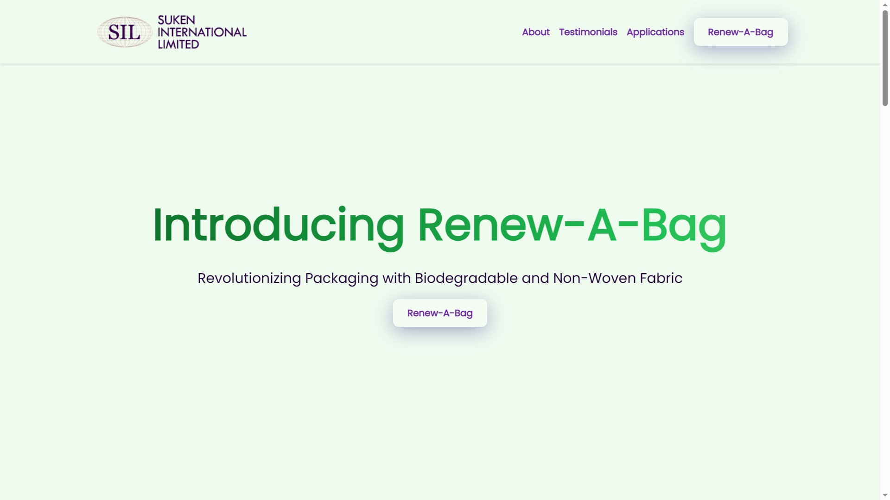
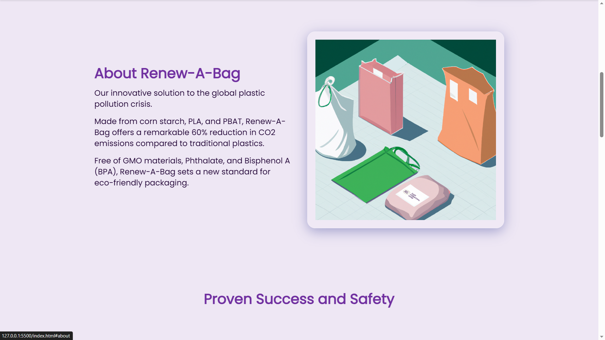
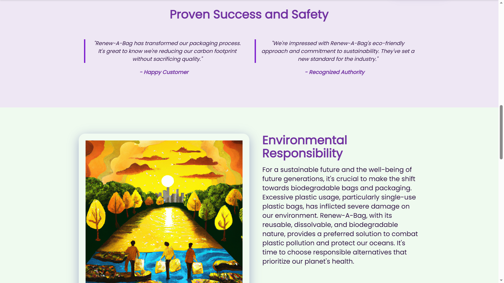
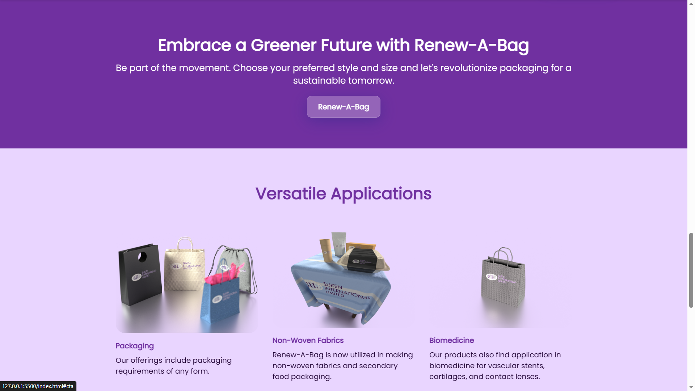
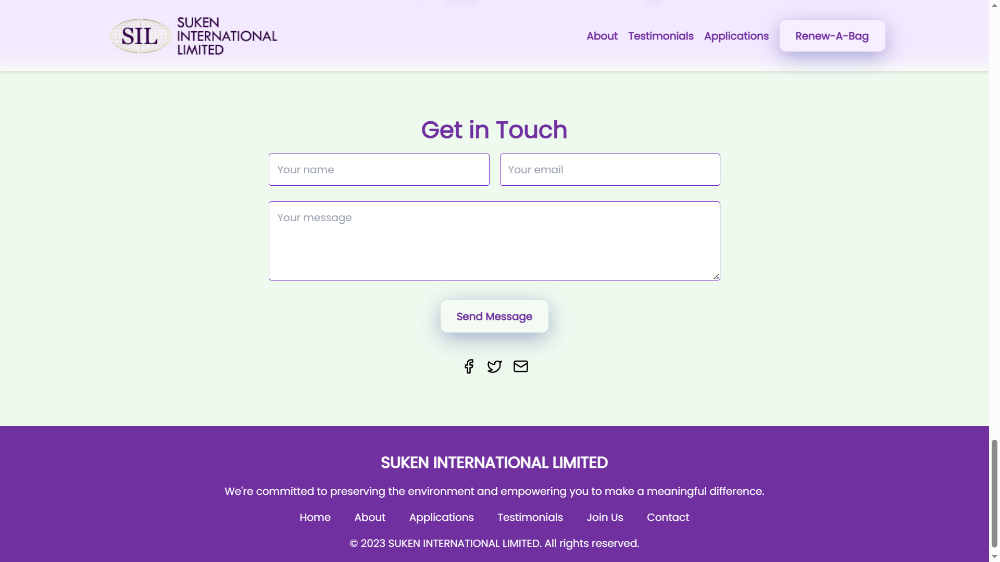

# Renew-A-Bag

**A web project by Charles Oduk II**

## Table of Contents

- [Introduction](#introduction)
- [Technologies](#technologies)
- [Features](#features)
- [Screenshots](#screenshots)
- [Setup](#setup)
- [Support](#support)
- [Legal Information](#legal)
- [Author](#author)

## Introduction

Renew-A-Bag is a web project developed by Charles Oduk II for Suken International Limited, with the goal of revolutionizing packaging with biodegradable and non-woven fabric. The project is focused on providing an innovative solution to the global plastic pollution crisis by offering eco-friendly packaging alternatives.

**Renew-A-Bag is NOT an open-source project and all rights are reserved by the author.**

## Technologies

The project was developed using the following technologies:

- HTML5
- CSS3 (Tailwind CSS)
- JavaScript

## Features

Some notable features of this web project include:

- Responsive design: The website adapts beautifully to various screen sizes and devices.
- Animated on-scroll content: Content appears with smooth animations as users scroll through the page, providing an engaging user experience.
- Sticky navigation: The top navigation bar remains visible as users scroll down the page, making it easy to navigate between different sections.
- Working contact form: The built-in contact form allows users to get in touch with Suken International Limited directly from the website.

## Screenshots

## Setup

To run this project locally, follow these steps:

1. Clone the repository or download the ZIP file.
2. Open the `index.html` file in your preferred web browser.
3. Explore and enjoy the website.

## Support

If you have any questions or concerns about the project or need further assistance, please feel free to get in touch with Suken International Limited or the author, Charles Oduk II.

## Legal

© 2023 Charles Oduk II for Suken International Limited. All rights reserved.

The source code and assets of this project are protected by copyright and are not available for public use. Redistribution, modification, or commercial use of any part of this project is strictly prohibited without prior written permission from Charles Oduk II.

## Author

This project was developed by **Charles Oduk II**. For any inquiries, please contact the author directly or reach out to Suken International Limited.
